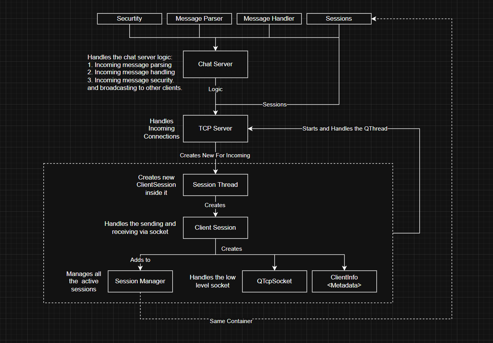
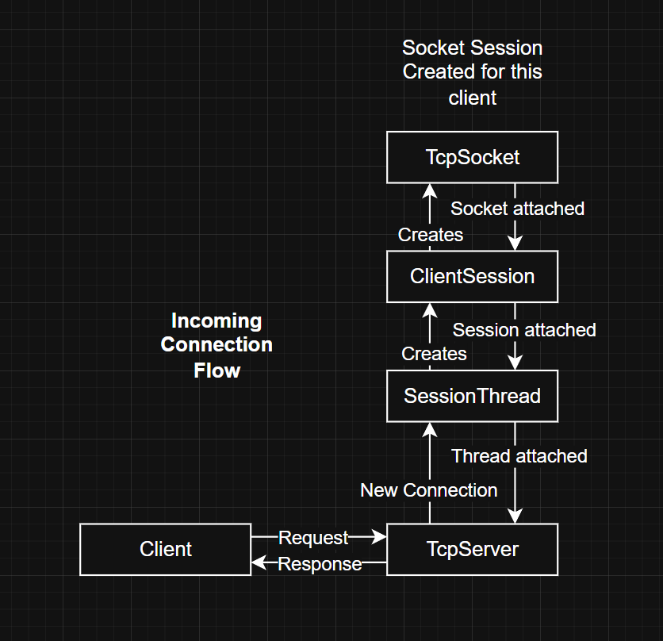
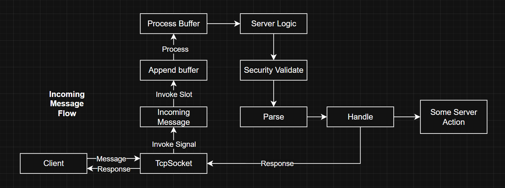

# CTI Chat Server Documentation

!!! Author: Mohamed Ashraf (mohamed.ashraf@coretech-innovations.com)

## 1. Introduction
In the modern digital era, real-time communication is the backbone of collaborative environments. A **Chat Server** acts as a central hub (middleware) that facilitates the exchange of data between multiple remote clients. By managing persistent connections, the server ensures that messages are routed accurately, user states are synchronized, and the communication remains secure and performant.

At its core, a chat server is responsible for:
*   **Connection Management:** Handling the lifecycle of TCP/IP or WebSocket connections.
*   **Session Tracking:** Identifying unique users and maintaining their active states.
*   **Message Routing:** Receiving data from one source and broadcasting it to the intended recipients.
*   **Concurrency:** Managing multiple simultaneous users without blocking system resources.

---

## 2. Project Overview: CTI Chat Server
The **CTI Chat Server** is a high-performance, asynchronous communication backend built using **C++** and the **Qt Framework**. It is designed to handle robust messaging tasks within the `cti-proj-wx` ecosystem.

### 2.1 Technical Philosophy
Unlike traditional synchronous servers, the CTI Chat Server leverages the **Qt Event Loop** and **Signal/Slot architecture** to handle networking non-blockingly. This ensures that the server remains responsive even as the number of connected clients scales.

### 2.2 Core Components
The architecture is divided into three main logical layers:

1.  **Network Layer (`ChatServer`):** Built on `QTcpServer`, this component listens for incoming connection requests on a designated port and performs the initial handshake.
2.  **Session Management (`SessionManager`):** A registry that tracks all active `ClientSession` objects. It is responsible for global broadcasts and ensuring that each user is uniquely identified.
3.  **Client Logic (`ClientSession`):** A dedicated handler for each connected user. It manages individual socket state, processes incoming packets, and handles clean disconnection procedures.

### 2.3 Key Features
*   **UUID Identification:** Every client is assigned a unique `QUuid` (RFC 4122) upon connection, ensuring collision-free identification across the network.
*   **Smart Memory Management:** Utilizes modern C++ memory safety patterns, including `std::shared_ptr` for shared server resources and Qt’s parent-child system for automatic cleanup.
*   **Robust Logging:** Integrated with a custom `EMIT_INFO` logging system for real-time monitoring of server health and client activity.

---

## 3. Technology Stack
| Component | Technology |
| :--- | :--- |
| **Language** | C++17 / C++20 |
| **Framework** | Qt 6 (Core, Network) |
| **Protocol** | TCP/IP |
| **ID Generation** | QUuid (Version 4 Random) |
| **Build System** | CMake / qmake |

## Architecture
Architecture Topview: 

Incoming Connection Flow:

Command Process Flow:
