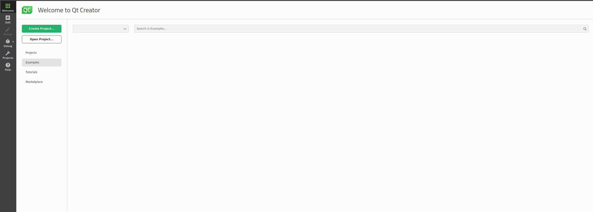
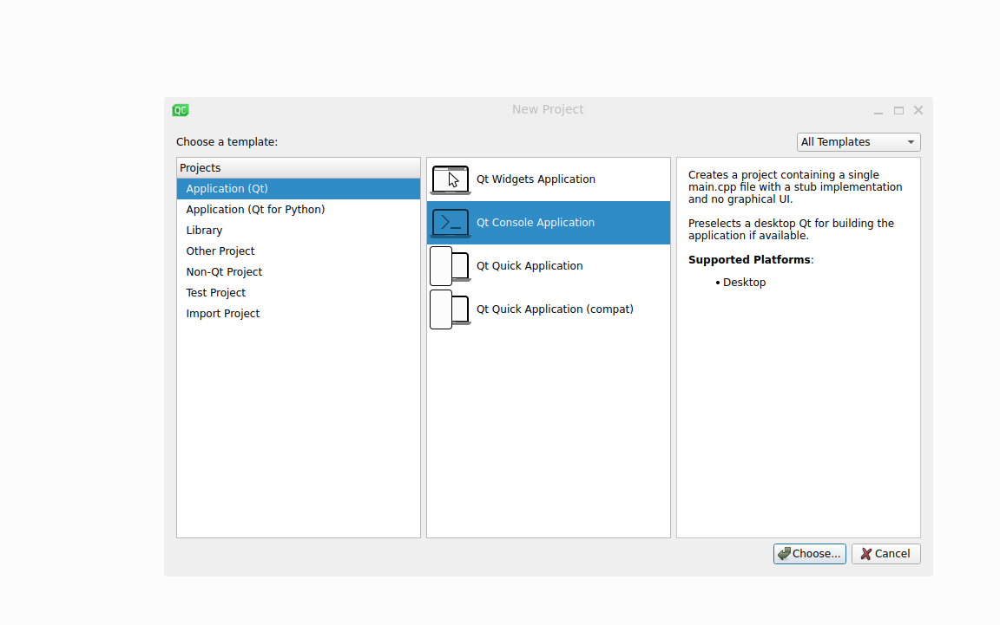
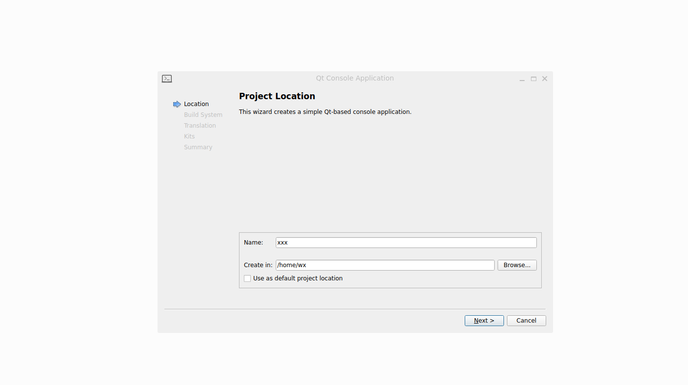
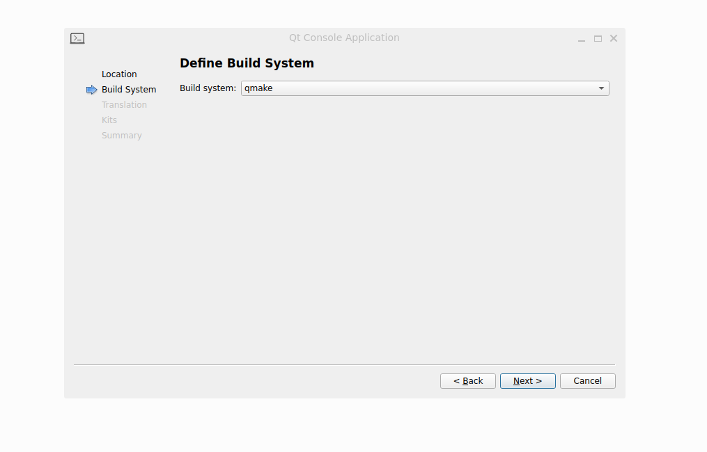
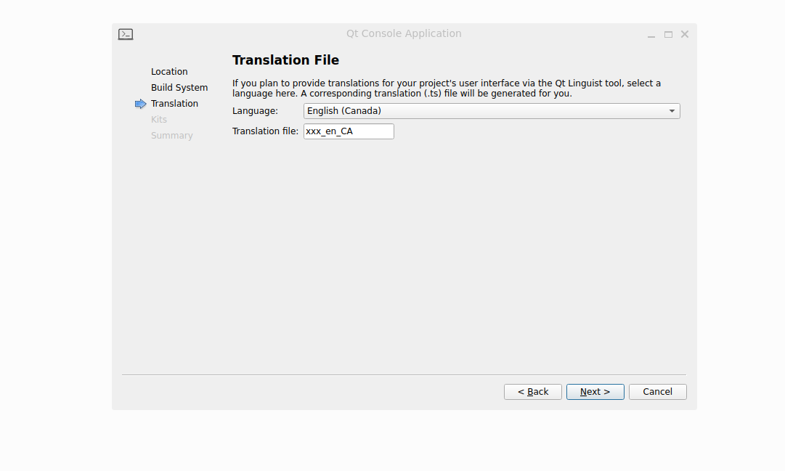
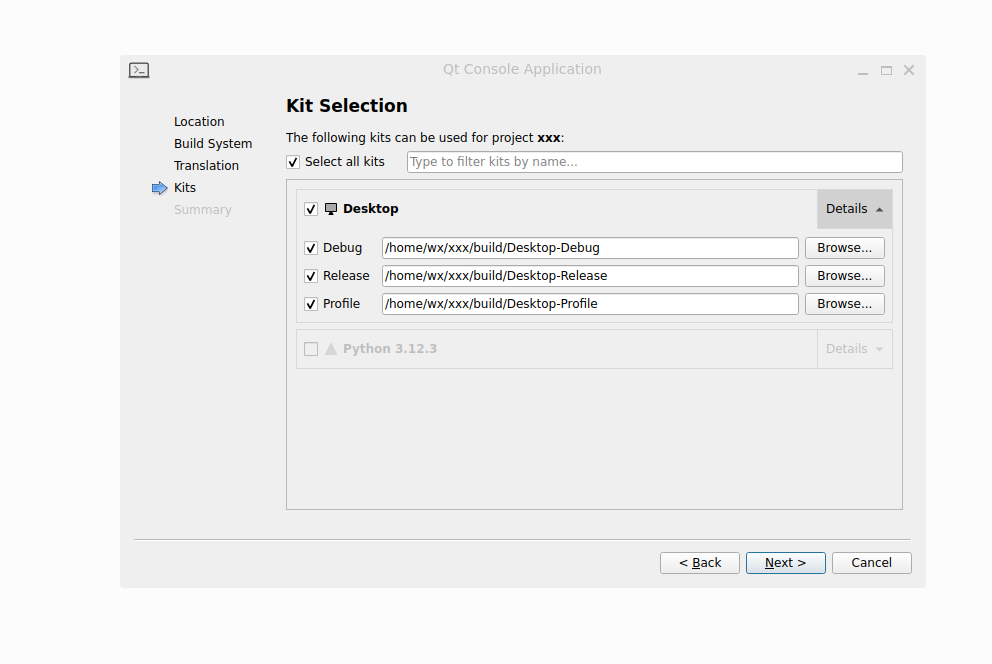
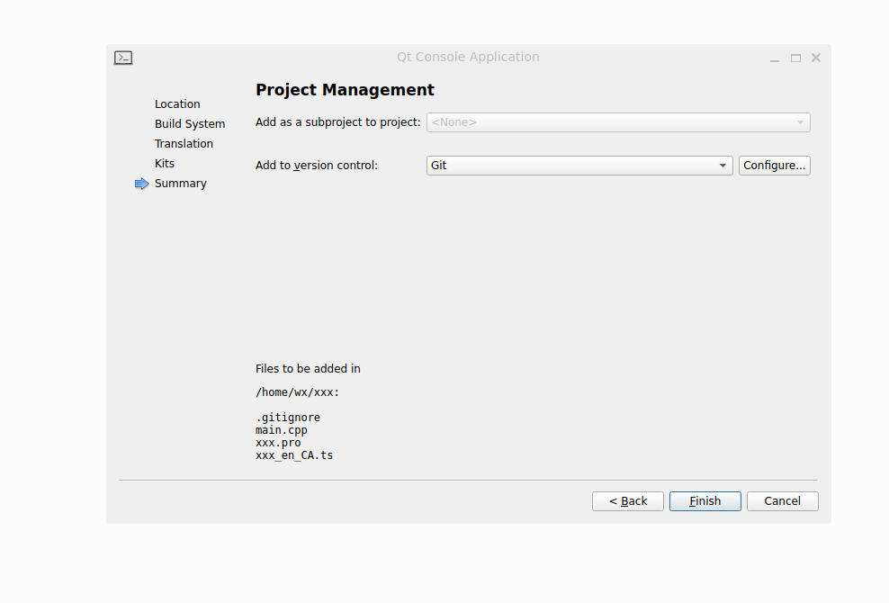
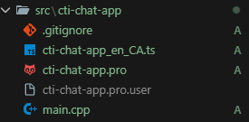

# Qt Project Configuration

## Creating a QT Console Application

First run the qtcreator app command from terminal  

```bash
qtcreator
```  

This will open a GUI follow the following steps to get started: 

1. After this go to `Create Project`.

2. Select `Application (Qt)` -> `Qt Console Application`.

3. Enter the `project name` and `project location directory`.  

4. Select build system `qmake`.

5. Select the translation `as you want`.

6. Select the project kits.

7. Select the version control framework as `git`.


After this you will find the generated code ready at the location selected earlier, and project is ready to work.

